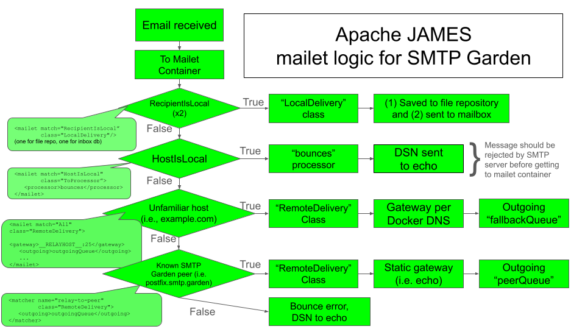

## Key configuration items

James is an enterprise application, with enterprise-scale configuration.
- Main config files are deployed to [/app/james/conf/](conf/).
  - Contents sourced/edited from various Apache James resource sites
  - [conf/mailetcontainer.xml](conf/mailetcontainer.xml): Main message transport instructions.
    - Directs emails to local users, SMTP Garden peers, or echo server, respectively.
    - Contains a custom matchers and mailet logic.
    - Can set a HELO name that James identifies self as when relaying to other SMTP servers.  The default is the hostname (set by docker), or can be manually overridden by setting the \<heloName\> child of a mailet.
    - See also "Transport Pipeline" below
  - [conf/smtpserver.xml](conf/smtpserver.xml): socket bindings, greeting message.
  - [conf/domainlist.xml](conf/domainlist.xml): tells James what domain name(s) to identify as.
    - Attempts autodetect and authorizes domain literals (autodetectIP)
    - Also set to explicitly recognize `localhost`, `james`, `james.smtp.garden`
  - [conf/activemq.properties](conf/activemq.properties) : seemingly necessary but insufficient config for __disabling__ ActiveMQ metrics (i.e., log spam).
  - [conf/keystore](conf/keystore)
    - Generated file, expected by James to match fields in smtpserver.xml.
    - Everything may work fine without this, feel free to try without it.
    - Uses default passphrase "james72laBalle" (a default, legacy, James phrase).
  - [conf/mailrepositorystore.xml](conf/mailrepositorystore.xml) defines repositories (not to be confused with mailboxes) as local files.
  - [conf/usersrepository.xml](conf/usersrepository.xml) file-based users repository was previously deprecated.  Without a working drop-in database of users, it is necessary to add local users via startup script (see __target inboxes__, below).
- Other files from https://github.com/apache/james-project/tree/master/server/apps/spring-app/src/main/resources (especially James 3.8.1).
  - Many of them can be removed, but incorporating them silences nuisance console warnings.

## Transport Pipeline:
How it works: message processing is defined primarily by contents of `conf/mailetcontainer.xml`.  The \<mailetcontainer\> tag contains the \<processors\> child, which contains individual \<processor\> children.  A processor is a sequence of mailets (i.e. analagous to servelets) that each do something to the message in sequence.  They can modify the message, save it to a local user's inbox, forward it to another gateway, ghost it, etc.
- `root` processor immediately passes valid mail to the `transport` processor.  These names appear to be mandatory.
- `transport` removes MIME headers (also mandatory), then tries to match it to one of several mailets.
- Local user addresses match mailet class RecipientIsLocal.  Two sequential mailets first save the email to file repository, then save it to a mailbox, respectively.
- If the hostname is local but the username is not recognized, the message is immediately rejected by the SMTP server (i.e. upon receipt of an invalid RCPT).
- Addresses to unknown domains (non-SMTP garden hosts) match the custom matcher `not-relay-to-peer`, and are shunted to the `ToFallback` processor.  This goes to echo via \<gateway\>.
- Addresses to SMTP garden hosts ("peers") match the custom matcher `relay-to-peer`, and are shunted to the `ToPeer` processor.  James attempts to identify these hosts via docker DNS.  MX lookup will fail, but James should then succeed with the A record.
- This pipeline should exhaust all possible destinations, but a bounce relay is configured as an error annunciator.
- Note: the mailet `<outgoing>` value represents the name of a mailet's respective outgoing email queue.  It __must__ to be unique between `ToPeer` and `ToFallback` or unexpected delivery behavior may result.

## Mailboxes / Issues
- Two local mailboxes have been created, but an alternative delivery mechanism to Maildir is needed.
  - Usernames are `user1` and `user2`, and they are manually added during container startup.
  - __Ideally__, local user inboxes could be statically configured via a pre-made, "drop-in" database.  Since that has not been solved, a functional alternative is to use the script `james-cli.sh` to manually add local user accounts after the James server is running.
  - The container's startup script anticipates __10 seconds__ required before this can be done, and `sleep`s accordingly.  Depending on your system, you may need to modify the sleep time.  The alternative would be to loop a healthcheck until it indicates the server is ready, but the developer-suggested method \([`curl -XGET http://172.17.0.2:8000/healthcheck`](https://james.apache.org/howTo/custom-healthchecks.html)\) does not work well for these purposes.
- Maildir format was deprecated in a prior James version.  Locally stored emails are in a binary format, with basically human-readable content. (see /james/app/mail/inbox/)
  - `inbox/` is volumized, maps to `/james/app/mail/inbox` within the container.
  - Even though it is not used, `home/.../Maildir/...` was created and volumized for an earlier version of James, and remains enabled (but unused) until it is decided to remove it.  __No mail is currently delivered here.  See the `james-maildir`image for the alternative.__
  - Future work may include enabling IMAP, POP, installing procmail|maildrop|fdm, adding a locally-running LMTP server, etc.

## Useful links
http://james.apache.org/server/3/config.html
https://james.apache.org/server/3/apidocs/org/apache/james/transport/mailets/
https://james.apache.org/mailet/standard/mailet-report.html
https://james.staged.apache.org/james-distributed-app/3.8.0/configure/mailets.html
https://github.com/apache/james-project
https://github.com/apache/james-project/blob/master/server/mailet/mailets/src/main/java/org/apache/james/transport/mailets

## TODO
- [ ] LMTP mailer
